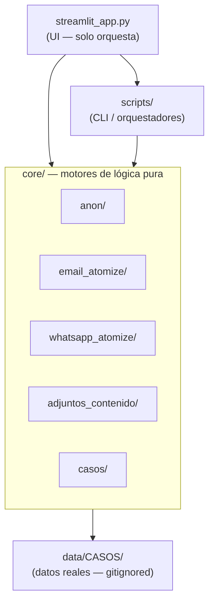
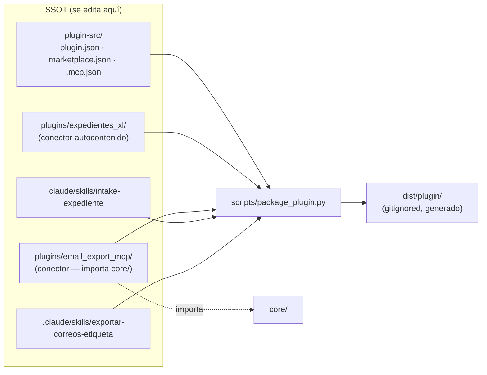
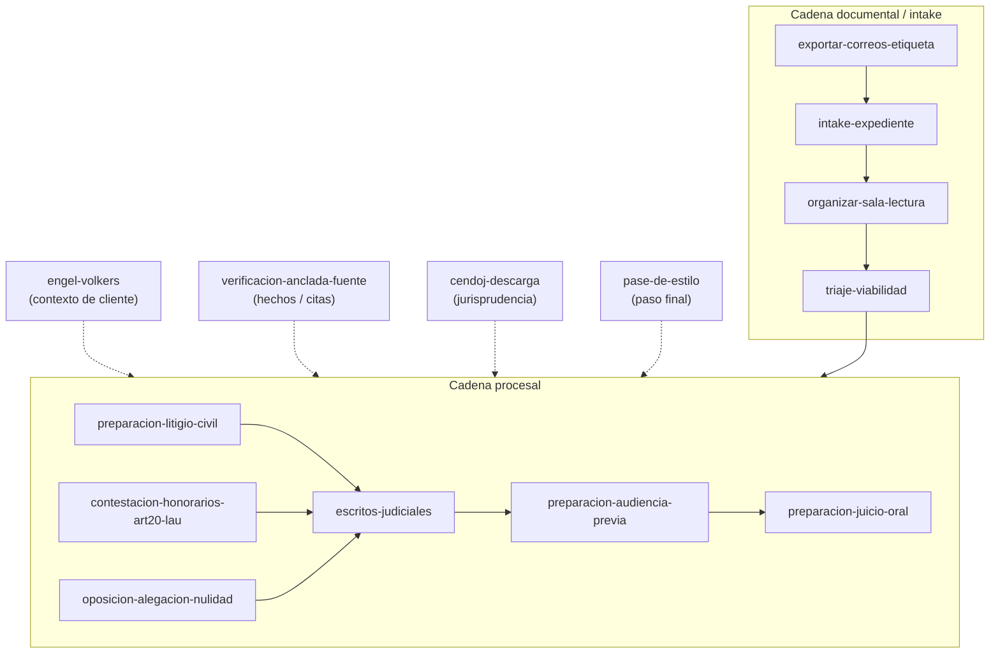

# Arquitectura de relaciones — FeesDefender

> Mapa de cómo se relacionan las piezas del proyecto en tres capas: **código**,
> **plugin** y **skills**. Complementa `docs/ARQUITECTURA.md` (deps técnicas) con
> la vista de *quién depende de quién* y *dónde vive la fuente de verdad*.

## Principio rector: SSOT (Single Source of Truth)

**SSOT = fuente única de verdad.** Cada artefacto se define y edita en **un solo
lugar canónico**; todo lo demás son copias *generadas* desde ahí, que nunca se
editan a mano. Si un dato vive en dos sitios y se edita por separado, diverge y
deja de saberse cuál es el correcto. La SSOT elimina esa ambigüedad: hay un
original y N copias derivadas, más un *build* que las regenera y, cuando procede,
un test que impide el *drift*.

| Artefacto | SSOT (se edita aquí) | Copia derivada (no editar) | Build | Test anti-drift |
|---|---|---|---|---|
| Lógica de dominio | `core/` | — | — | `tests/` |
| Metadatos del plugin | `plugin-src/` | `dist/plugin/` (gitignored) | `scripts/package_plugin.py` | — |
| Skills | `.claude/skills/<skill>/` | `dist/plugin/.../skills/`, `.skill` empaquetado | `package_plugin.py` / `package_skill.py` | `validate_skills.py` |
| Helpers de skills | `.claude/skills/_shared/*.py` | `scripts/` de cada skill (copia byte a byte) | `scripts/sync_skill_helpers.py` | `tests/test_skill_helpers_sync.py` |
| Estado / plan | repo: `STATUS.md`, `PLAN.md` | — (Drive abandonado por divergencia) | — | — |
| Auth/API sudespacho | `../ElContable/docs/REFERENCIA_SUDESPACHO_API_PERMISOS.md` | `docs/INTEGRACION_SUDESPACHO.md §14` | — | — |
| Higiene de datos y secretos | `docs/SEGURIDAD_DATOS.md` (doctrina) | `CLAUDE.md §Reglas`, `GOBERNANZA §4` (enlazan) | — | `pre-commit` + CI de escaneo de fugas |

## 1. Código — arquitectura de 3 capas

Regla que nunca se rompe (CLAUDE.md): **UI → Core → Datos**. La lógica vive en el
core; la UI solo orquesta.

## 2. Plugin — SSOT de metadatos + conectores, ensamblados por build

El plugin `feesdefender` (marketplace `despacho-tyukhay`) **se ensambla, no se
edita ensamblado**. `package_plugin.py` reúne metadatos + conectores + un
subconjunto de skills en `dist/plugin/` (gitignored, reproducible).

- **`expedientes-xl`**: autocontenido. Deposita ficheros al Drive (`G:`).
- **`email-export`**: **depende de `core/`** → solo corre en el PC del abogado
  (repo clonado + token OAuth `~/.gmail-mcp/` + Drive en `G:`). No funciona en
  móvil, navegador ni Cowork en la nube.
- El plugin **no carga nativo en Cowork**: se replican los servers en
  `claude_desktop_config.json`.

## 3. Skills — SSOT en `.claude/skills/`, tres tipos de relación

`.claude/skills/` es la fuente única de desarrollo (el repo externo
`despacho-skills` está archivado/deprecado).

### 3a. Skill → helpers `_shared/` (copia byte a byte)

`sync_skill_helpers.py` replica `_shared/*.py` a la carpeta `scripts/` de cada
skill objetivo, para que el `.skill` empaquetado sea **autónomo** (no puede
importar `core/` ni `_shared/` en runtime). `test_skill_helpers_sync.py` exige
cero drift.

### 3b. Skill → motor de código (`core/` / `scripts/`)

`intake-expediente`, `exportar-correos-etiqueta` (y las nativas `docx`, `pdf`)
invocan motores locales; p.ej. `exportar-correos-etiqueta` corre
`core.email_export` / `scripts.export_label_emails`.

### 3c. Skill → skill (orquestación)

Transversales que consumen casi todas las skills procesales:
`verificacion-anclada-fuente` (fondo/citas), `cendoj-descarga` (jurisprudencia)
y `pase-de-estilo` (estilo de la casa, paso final antes de firmar).

## 4. Relaciones cross-proyecto (despacho Tyukhay Legal)

FeesDefender comparte SSOT con los otros proyectos del despacho:

- **`REFERENCIA_SUDESPACHO_API_PERMISOS.md`** (auth/API/permisos de
  sudespacho.net): SSOT en `../ElContable/docs/`, **compartida con El Contable y
  El Auditor**, fusionada en `docs/INTEGRACION_SUDESPACHO.md §14`.
- **`despacho-plugins`**: repo privado de distribución del plugin ensamblado.
- **`despacho-skills`**: repo archivado (solo conserva `SKILL_AUTHORING.md`).

---

*Resumen del patrón*: una SSOT por artefacto + un build que ensambla copias
autónomas + un test de sincronización que garantiza cero drift.
